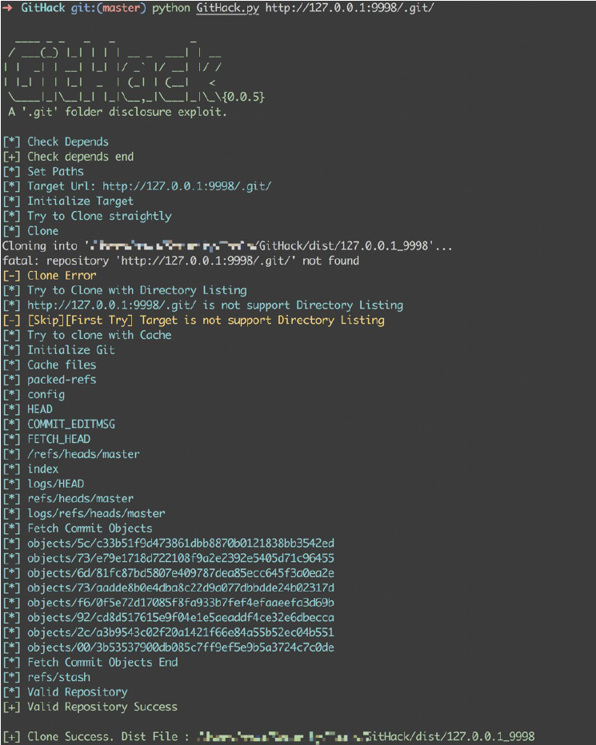
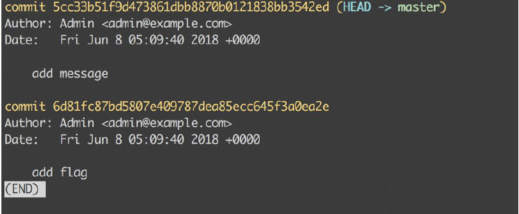
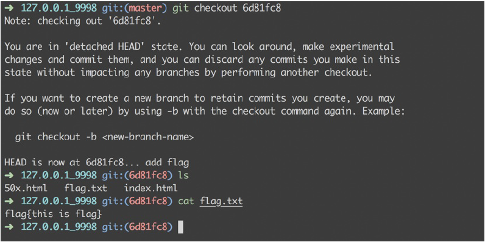

# 金融业网络安全攻防比赛测试题 2018 Babygit

## 题目描述

这台服务器总是发生代码泄露，攻击者究竟是从哪里入手呢？

## 知识点

- git源代码泄露

## 启动

```
docker-compose up -d
http://127.0.0.1:5001
```

## 解题方法

1. 首先进行目录扫描，可以发现存在.git目录，使用Githack工具将目录保存到本地。
工具：https://github.com/BugScanTeam/GitHack


2. 使用git log命令进行查看

3. 看到有一个commit操作是add flag，使用git checkout 6d81fc8命
令切换到add flag操作时的状态，就可以看到flag


## 拓展延申

git目录是Git用于进行跟踪管理版本库的。

在实际生产中，常常出现直接将.git文件夹发布到生产环境的情况，攻击者能够利用.git文件夹获取源码，导致严重的信息泄露。